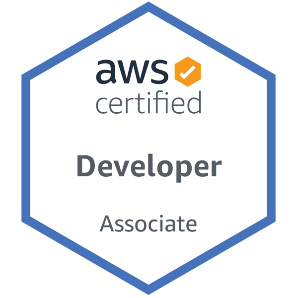

### Overview
Experienced in architecting AWS and GCP solutions, any server task automation, developing event-driven Serverless microservices, backend RESTFul API development. Worked on challenging projects involving real-time collaboration and complex architecture. My strength lies in the ability to analyze any problem critically, always focus on building resilient and robust services that can scale up, rapid prototyping and choosing the appropriate technology based on the scenario. 

### Work Experience
* Ex Software Engineer(Data & Cloud)  
  June 2020 - October 2020  
 [National Australia Bank](https://www.nab.com.au/)
* Software/Data Engineer 
  September 2018 - May 2020 
  [Webjet Limited](https://www.webjetlimited.com/)
* Software Engineer(Backend) 
  December 2016 - August 2018 
  [NowBoarding Pty Ltd](https://www.nowboarding.com.au/)

### Education
* Bachelor of Science in Software Engineering 
  [Institute of Information Technology, University of Dhaka](http://www.iit.du.ac.bd/)

### Certifications
* [
 AWS Certified Developer Associate](https://www.youracclaim.com/badges/7382a71d-538c-43eb-9ef6-8f42cf868547/public_url)

### Notable Projects
* [Duress](https://www.duress.com/)   Duress is a live protection app. If you are in an emergency, the Duress app will send live video, live location tracking and your profile information to our Operations Centre. Our Operations Centre will then contact the Police.
* [ViewBid](https://www.viewbid.com.au/)   Record and stream auction data live and share via email.
* <b>Hedging</b> rewrite and rearchitecture of Hedging project from Excel based legacy VB Macros to Containerised Python solution for B2B businesses of Webjet. Hedging is an investment process, which saves approximately 2M EUR every year for [WebBeds](https://www.webbeds.com/).
